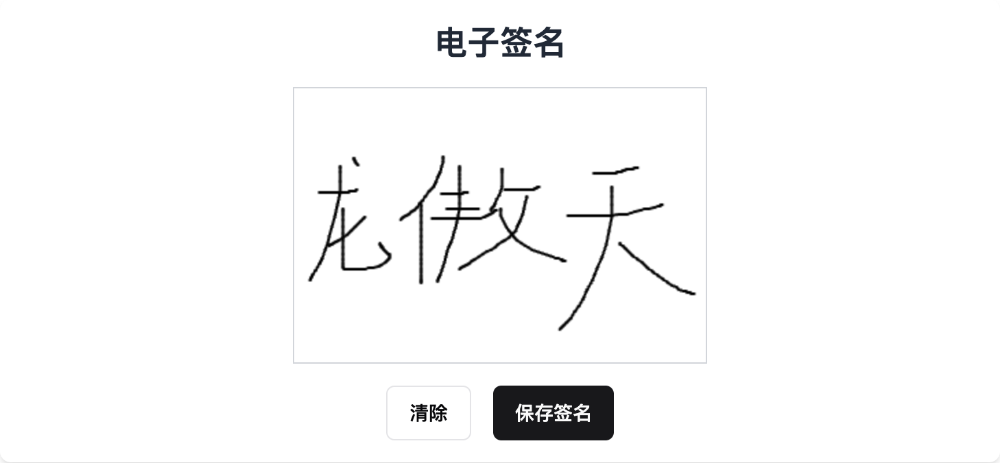

# 基于Canvas实现的电子签名

[](https://github.com/SmallTeddy/electronic-sign/blob/main/LICENSE)
[](https://github.com/SmallTeddy/electronic-sign/stargazers)
[](https://github.com/SmallTeddy/electronic-sign/network)

## 项目介绍

这是一个基于HTML5 Canvas实现的电子签名项目，允许用户在网页上绘制签名，并将其保存为图片。



### 功能特点

* **跨平台支持**：兼容所有现代浏览器。
* **响应式设计**：自动适应不同设备屏幕。
* **简单易用**：用户只需拖动鼠标或触摸屏幕即可签名。
* **高度可定制**：可根据需要调整Canvas大小和样式。

### 项目结构

```

electronic-sign/
│
├── src/                 # 源代码目录
│   ├── index.html       # 主页面文件
│   ├── style.css        # 样式文件
│   └── script.js        # 脚本文件
│
├── dist/                # 构建输出目录
│   └── bundle.js        # 压缩后的JavaScript文件
│
└── README.md            # 项目说明文件

```

### 安装指南

1. 克隆项目到本地：
   

```bash
   git clone https://github.com/SmallTeddy/electronic-sign.git
   ```

2. 进入项目目录：
   

```bash
   cd electronic-sign
   ```

3. 安装依赖（如果需要）：
   

```bash
   npm install
   ```

4. 构建项目（如果需要）：
   

```bash
   npm run build
   ```

### 使用方法

将 `src` 目录下的 `index.html` 、 `style.css` 和 `script.js` 文件包含到你的项目中，即可开始使用电子签名功能。

### 自定义配置

你可以通过修改 `style.css` 和 `script.js` 文件来自定义签名板的外观和行为。

### 贡献指南

欢迎贡献代码！在提交重大更改之前，请先创建一个issue进行讨论。

1. Fork本项目。
2. 创建你的分支：`git checkout -b feature/your-feature`
3. 提交你的更改：`git commit -m 'Add some feature'`
4. 推送到分支：`git push origin feature/your-feature`
5. 提交Pull Request。
